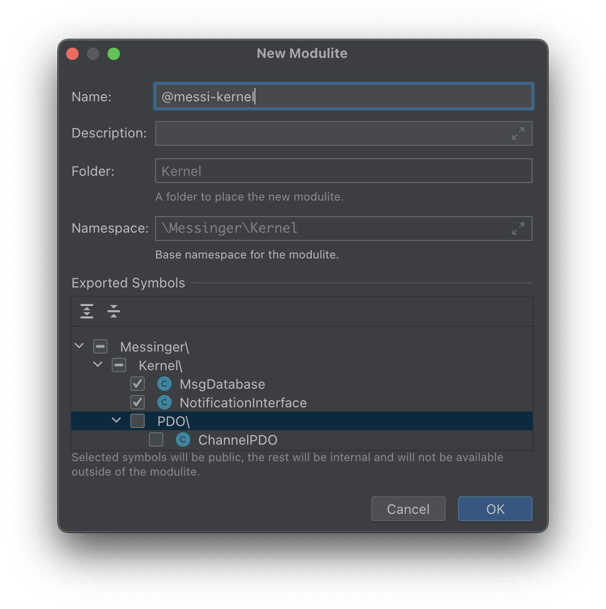
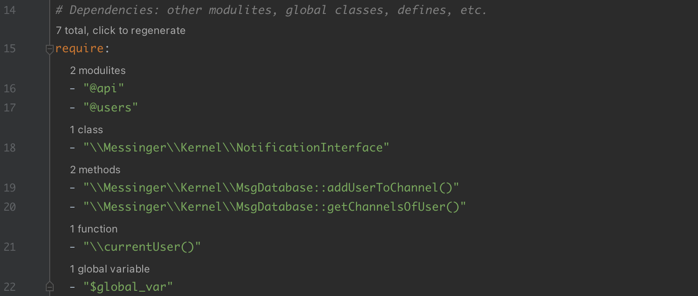
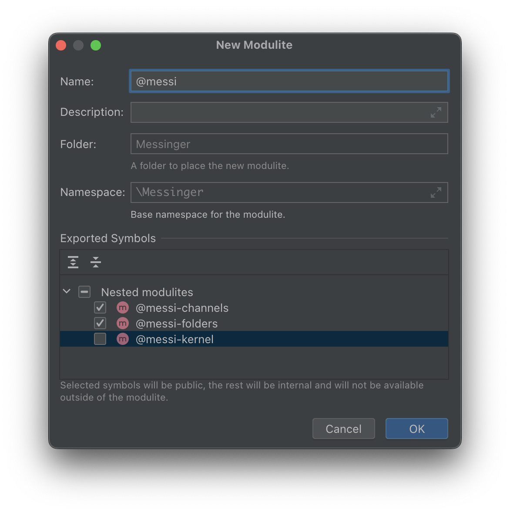
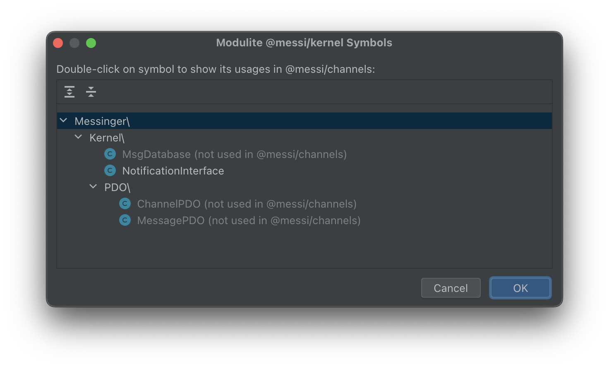
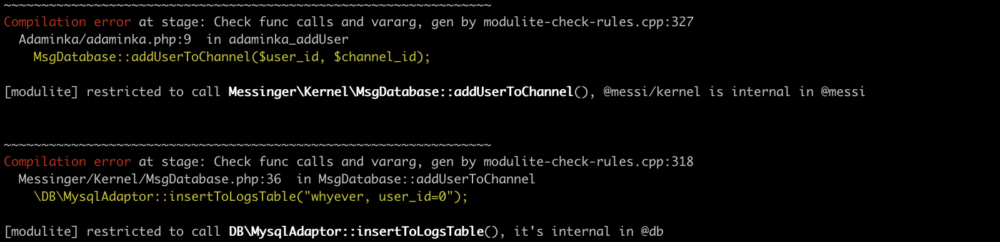

# Modulite

Modulite is a conception that **brings modules into the PHP language**.
PHP does not have native modules (internal classes, private namespaces, explicit exports),
and Modulite tries to eliminate this drawback.

This repo is a **Modulite plugin for PHPStorm**. It deeply integrates into an IDE,
allowing you to create modules from folders, declare private classes with hotkeys, and see errors right in the editor.
Actually, all "modularity" is represented as `.modulite.yaml` files,
and the plugin is a great UI that visualizes yaml config and provides actions to modify it.

**[Visit a landing page with details and examples (in Russian)](https://vkcom.github.io/modulite/)**

Here we'll briefly cover most important aspects in English.


## What is "a modulite"

Modulite adds modules to PHP without modifying PHP syntax, but declaring scopes in yaml files.

**A modulite** is a regular folder with a `.modulite.yaml` file inside. 
It declares name, exports, requires, and some other properties.
Modulite names start with "@", e.g. `@api` or `@db/pdo`.

**Export**. All classes / functions / constants within a modulite are either exported or internal.
If a symbol is internal, it's prohibited to be used outside the modulite. The plugin shows errors of such usages,
as well as hints in a file tree.


**Require**. All used symbols that are defined out of modulite scope, must be explicitly imported (required).
Using a non-required symbol shows an error with a quick fix.


## The goal of Modulite

The goal in two words: **prevent uncontrolled entropy growth** inside a monolith.
It's a way to isolate folders **in existing code**.

Huge projects (like VK.com, where Modulite was created) is a bunch of code with extreme connectivity,
and time makes things worse. Some developers want to extract pieces of code into Composer packages,
but until it's not autonomous, it's impossible (in 100% of cases, actually).
Every sensible namespace is connected with all other code — both forwards (uses) and backwards (is used).

Extracting to a package should be an iterative process, gradually decreasing folder's dependencies from external code.
A problem is, that while you are doing this, other developers may still use your functions supposed to be internal.
It's not a malicious intent, it's just a coincidence: there was no tool to control it. Until now.

Modulite allows to **isolate specific parts of code, that obey the rules specified by code owners**.
This allows to refactor code, little by little decreasing its dependencies — having a guarantee no new ones occur.
Ideally, a modulite tends to be fully autonomous, and then it may be exposed as a Composer package.

If to speak about existing solutions, you may remember `@psalm-internal`. That annotation allows to specify
a namespace where a function/class may be used. Probably, that annotation could be a solution for a "public interface",
but once you forget to write it over a new class, it occasionally becomes public.
In Modulite's conception, all new symbols are internal, an explicit `export` is needed.
Moreover, specifying `require` is even more important for a long term refactoring.

**By the way, a slight notice**. It's true, that when a modulite becomes independent,
it may be exposed as a Composer package. But do you really need this? If it's not supposed to be a shared piece of code,
you just leave a folder inside a monolith. An idea to "extract a package" exists just because of an association
"a package is good, it means isolation". And if isolation is provided by modularity,
**you don't need Composer** for these purposes.


## Features of the PHPStorm plugin

**Create a modulite from existing folder**. A wizard scans a folder and lets you uncheck symbols to declare internal.
All requires are automatically generated.



**Mark a symbol exported/internal**. Every symbol inside a modulite has a hint `exported from @name`
(or `internal in @name`). Visibility is changed either by *Alt+Enter* or via a context menu on a hint. 
These hints are interactive: *@name* is clickable (navigates you to a *yaml* file).

Visibility rules are the following:
* all new symbols are internal unless manually exported
* if a class is exported, its fields / constants / methods are also exported by default
* but even in an exported class a concrete member may be forced to be internal


**Making an already used class internal**. If you just make an already used symbol internal,
that usages will arise errors. Here's what you can do: make a symbol internal, but allow all
current usages "as an exception". It makes your current code still work, but new code is 
denied to use an internal symbol. So, we just stabilize current state and don't let it become worse.
A plugin's action *"Make internal in @name"* makes this automatically.
It's stored as a special section `allow-internal-access` in `.modulite.yaml`.


**Hide members of an exported class**. In rare situations, you may want to deny a method from an external code,
but a class should be exported, and a method should have *public* modifier (since it's called from other classes).
This doesn't remind a good architecture, but remember, that we are dealing with *existing*, non-perfect code,
and the goal is to restrict its usages. The plugin gives you all necessary UI, 
modifying `force-internal` in yaml.


**New code and `require`**. You might remember, that all external symbols need to be manually listed:
* other modulites `@another-modulite`
* composer packages `#some/package`
* extern classes `\Some\External\Class`
* static method of classes `\Some\External\Class::itsMethod()`
* extern global functions `\externalGlobalFunction()`
* extern defines and constants `\SOME_DEFINE`
* all global variables `$global_var`


A plugin checks that every symbol you use is listed here and allows you a quick fix.
It will lead to a change in a yaml file — an explicit newly-created dependency, visible in code review and Git. 

If another modulite is required, all its exported symbols are available. The same for Composer packages.
If a class is required, all its constants, fields and instance methods are available.
Every static method is needed to be required separately, on purpose. 

As a result, whenever we look into a yaml file, **we always see how our modulite depends on external code**.



**Submodulites**. Modulites may be nested, a nested modulite's name starts from a parent. 
E.g., if `@messi` is a parent, `@messi/folders` is a child. A submodulite may be exported from a parent.



**Find usages inside a modulite**. Every class/function now has additional items in a context menu.
For example, you read a modulite's code and see a call `currentUser()`. You may have interested:
are there many such calls? (if there is only a couple, it seems easy to get rid of this dependency).


**Connectivity between modulites**. Similar to above, but more complex. Say, you've required `@messi/kernel` 
to use some kernel class. After, when writing a code and start using other symbols from kernel,
you don't have to update requires. And once, you ask yourself a question: how many symbols from kernel do I use?
You just click *"Find usages in @my"* in a context menu in `my/.modulite.yaml`.



**Tip**. A [landing page](https://vkcom.github.io/modulite/) contains more details and screenshots.


## A .modulite.yaml file structure

```yaml
name: "@modulite-name"
description: "..."
namespace: "Some\\Namespace\\"

export:
  - "ClassInNamespace"
  - "OrConcrete::CLASS_MEMBER"
  # and others

force-internal:
  - "ClassInNamespace::staticMethod()"
  # and others

require:
  - "@another-modulite"
  - "#composer/package"
  - "\\GlobalClass"
  # and others

allow-internal-access:
  "@rpc":
    - "ClassAllowedForRpcModule"
    - "OrConcrete::method()"
    # the same format as in 'export', actually
  "\\globalFunction()":
    # more exceptions
  "\\Some\\GlobalClass":
    # and others
```

The config is the reason why Modulite works in Git hooks and CI, not only within an IDE. 


## Modulite in Git hooks and CI

For real usage, it must be possible to validate your code as a whole.

**Modulite + PHPStan**

There is [a PHPStan plugin](https://github.com/VKCOM/modulite-phpstan) for regular PHP projects.
A plugin reads yaml configs emitted by PHPStorm and has all necessary checks implemented. 
Errors are printed as expected.


**Modulite + KPHP**

Modulite is integrated into [KPHP](https://github.com/VKCOM/kphp) (a PHP compiler from VK.com) out of the box.




## Modulite + Composer

Nothing prevents you to develop Composer packages using Modulite: to create subfolders with internal symbols, etc.
It just helps you organize code.

When somebody uses your package in his project from any modulite, 
he must add `#your/package` to requires. Actually, every embedded Composer package becomes an implicit modulite,
and all modularity checks work automatically. 

Modulites nested to a package are prefixed when embedded to a monolith.
Say, you have `@impl` in your package. When embedded as vendor, it will be treated as `#your/package/@impl`.
Since you export concrete symbols from `@impl`, a monolith can't use its internals.


## Export classes from a Composer package

Let's talk about Composer alone. What is a package? Just a set of classes/functions and a way to autoload them.
But actually, no one prevents a monolith to use various helpers from a package, pretended to be non-public.

Modulite extends the functionality of Composer packages: it allows you to declare exports.

It's done in the following way. At a root folder, near `composer.json`, place a `.modulite.yaml` file:

* **name** = "<composer_root>"
* **namespace** = "The\\\\Same\\\\\As\\\\PSR4\\\\"
* **export** list as usual
* **force-internal** also works
* **require** leave blank, it's filled from "requires" of *composer.json*


## "A module" vs "a modulite"

Not to be messed with JS modules, CSS modules, etc., we use the word "modulite". Treat this word in two ways: 
* "lite module" = "module" + "lite"
* "module in a monolith" = "modulith(e)".


## How to I start using Modulite?

Proceed to **[modulite-example-project](https://github.com/VKCOM/modulite-example-project)** and follow instructions.

Also, a reminder about [a landing page](https://vkcom.github.io/modulite/).

And don't forget to install a PHPStorm plugin.


## Contributing notes

Keep in mind, that all logic of Modulite behavior must be equal in 3 places:
* Modulite in PHPStorm (this repo); checks are represented as IDEA inspections, symbols resolving also rely on PHPStorm internals.
* Modulite in [KPHP](https://github.com/VKCOM/kphp); initial implementation of modules was made for KPHP+PHPStorm combination, and later the same logic was exposed as a PHPStan plugin to be used in regular PHP projects.
* Modulite in [PHPStan](https://github.com/VKCOM/modulite-phpstan); lots of code related to yaml validation and rules checking are ported from the C++ implementation and must be kept in sync with KPHP, to remain sustainable.

If you find a bug, it's either a specific bug related to PHPStorm peculiarities, or it may be a bug that also exists in other implementations and should be fixed simultaneously. If you have a feature request, it must be implemented in three repos at the same time, covered with the same tests, also. So, feel free to file issues, we'll find a way to manage them.


## The License

Modulite is distributed under the MIT License, on behalf of VK.com (V Kontakte LLC).

Made by [KPHP Team](https://github.com/VKCOM/kphp) from VK.

